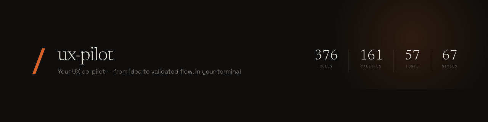

<p align="center">
  
</p>

<p align="center">
  <strong>Your UX co-pilot — from idea to validated flow, in your terminal.</strong>
</p>

<p align="center">
  <a href="https://github.com/Sakaax/ux-pilot/blob/main/LICENSE"></a>
  <a href="https://github.com/Sakaax/ux-pilot"></a>
  <a href="https://www.producthunt.com/products/ux-pilot-2"></a>
  <a href="https://ux-pilot.sakaax.com"></a>
</p>

<p align="center">
  <a href="#installation">Install</a> &nbsp;·&nbsp;
  <a href="#4-phases">How it works</a> &nbsp;·&nbsp;
  <a href="#376-ux-rules">Rules</a> &nbsp;·&nbsp;
  <a href="https://ux-pilot.sakaax.com/demo.html">Try the demo</a> &nbsp;·&nbsp;
  <a href="https://ux-pilot.sakaax.com">Landing page</a>
</p>

---

A Claude Code plugin that acts as a **senior UX designer**. It doesn't generate code blindly — it understands your product, challenges your choices, shows you the result in a live browser preview, and helps you iterate until the flow is validated.

## What's New (v0.1.2)

- **HTML Audit Report** — audit results now open as a styled, navigable HTML page in your browser
- **Fix Prompts** — each finding includes a ready-to-paste prompt to fix the issue in Claude Code
- **Persistent UX Brief** — discovery saves `ux-pilot/ux-brief.md` in your project, updated as you go

> Having issues updating? See [Troubleshooting](#troubleshooting).

## Why ux-pilot?

Every AI tool generates the same generic output: Inter font, purple gradient on white, centered hero, done. **ux-pilot exists to fix this.**

Instead of jumping straight to code, it runs a **structured discovery flow** — asks about your product, users, and goals — then applies the right rules from **376 UX rules** sourced from WCAG 2.1, Nielsen Norman Group, and Laws of UX.

## What makes it different

| | Existing tools | ux-pilot |
|---|----------------|----------|
| **Approach** | Generate code directly | Dialogue first, code after |
| **Output** | One-shot result | Iterative, named versions |
| **Scope** | Landing pages mostly | Full apps (dashboards, CRUD, onboarding...) |
| **Preview** | No live preview | Local server with hot reload |
| **UX knowledge** | Few or no rules | 376 rules loaded on-demand |
| **Context** | Loads everything | Token-efficient (rules loaded per screen) |
| **Version naming** | V1, V2, V3 | Descriptive: "Classic", "Bold", "Minimal" |
| **Design quality** | Generic AI aesthetic | Anti "AI slop" rules built-in |

## Installation

```bash
# Step 1 — Add from marketplace
/plugin marketplace add Sakaax/ux-pilot

# Step 2 — Install the skill
/plugin install ux-pilot@ux-pilot
```

No API keys. No subscription. Free and open source.

## Usage

```bash
/ux-pilot              # Full flow (Discovery -> Audit -> Preview -> Export)
/ux-pilot audit        # Scan existing code for UX issues
/ux-pilot preview      # Jump to preview server
/ux-pilot export       # Generate UX spec + components
```

## 4 Phases

### 1. Discovery

The plugin asks you questions **one at a time** (ABCD choices + free text). It understands your product, users, business model, flows, design preferences, and SEO needs.

- Adapts questions based on your answers — skips irrelevant ones
- Goal: get to the Brief in **as few questions as possible**
- Output: a structured **UX Brief** saved to `ux-pilot/ux-brief.md` in your project
- Brief is updated as you make design decisions and validate screens
- Auto-added to `.gitignore`

### 2. Audit

If you have existing code, the plugin scans it automatically:

- Detects framework (Next.js, React, Vue, Svelte, vanilla)
- Scans routes, HTML, forms, images, navigation, accessibility, SEO, mobile
- Produces a **scored report** (XX/100) with findings by severity
- Each finding references the violated rule and suggests a fix
- **HTML report** opens in your browser — dark themed, grouped by severity
- **Fix prompts** under each finding — ready to copy-paste into Claude Code to fix the issue

### 3. Preview

The plugin opens a **local server** and generates your screens in vanilla HTML/CSS:

- 2-3 **named versions** per screen (not V1/V2/V3 — descriptive names)
- **Hot reload** via SSE — changes appear instantly
- Approve, reject, or comment per screen
- Rules loaded per-screen for token efficiency

### 4. Export

- Complete **UX spec** in markdown
- Converts approved screens to **React, Svelte, or Vue** components
- Detects your project's framework and follows its conventions

## 376 UX Rules

Rules are organized in 6 categories, **loaded on-demand** (never all at once):

| Category | Files | What's inside |
|----------|-------|---------------|
| **UX Patterns** | 10 | Accessibility, touch, forms, navigation, layout, typography, animation, empty states, tables, charts |
| **Conversion & Funnel** | 7 | CTA, pricing, signup, checkout, retention, churn prevention, 34 landing page patterns |
| **SEO & AEO** | 5 | Structure, meta/OG, performance, schema.org, AI citation optimization |
| **Psychology** | 4 | Social proof, cognitive load, trust, ethical persuasion |
| **Aesthetics** | 4 | Anti "AI slop" patterns, typography craft, backgrounds, 67 UI styles |
| **Product Type** | 1 | 30 product-type specific recommendations |

### Smart loading

Rules are loaded based on what you're designing:

| Screen type | Rules loaded |
|-------------|-------------|
| Landing page | landing-patterns, cta, seo, aesthetics, social-proof |
| Signup/Auth | signup-auth, forms-feedback, accessibility, trust |
| Dashboard | navigation, data-tables, layout-responsive, charts-data |
| Pricing | pricing, cta, social-proof, trust, psychology |
| Checkout | checkout, forms-feedback, trust, accessibility |
| Mobile | touch-interaction, layout-responsive, navigation |

## Built-in Data

| Dataset | Count | Content |
|---------|-------|---------|
| **Color palettes** | 161 | Industry-specific palettes with primary, accent, background, surface, text |
| **Font pairings** | 57 | Google Fonts pairs with mood tags and import URLs |
| **UI styles** | 67 | Style descriptions with use cases, avoid scenarios, CSS hints |
| **Product types** | 30 | Landing patterns, recommended styles, color focus, anti-patterns |

## Anti "AI Slop"

The plugin actively fights generic AI-generated aesthetics:

### Banned

- **Fonts**: Inter, Roboto, Arial, system fonts
- **Colors**: Purple gradients on white, timid palettes without accent
- **Layouts**: Cookie-cutter structures, predictable grids
- **Naming**: V1/V2/V3 version names

### Instead

- Distinctive fonts with **weight extremes** (100/200 vs 800/900)
- **3x+ size jumps** between heading and body
- Gradient meshes, noise textures, grain overlays
- Dominant color + **sharp accent**
- Descriptive version names: "Classic", "Bold", "Minimal"

## Tech Stack

| | |
|---|---|
| **Language** | TypeScript |
| **Runtime** | Bun (Node.js fallback) |
| **Preview** | Vanilla HTML/CSS (zero dependencies) |
| **Hot reload** | SSE (no WebSocket overhead) |
| **Tests** | 77 tests via Bun test runner |

## Project Structure

```
ux-pilot/
├── skills/ux-pilot.md        # Claude Code skill entry point
├── rules/                    # 376 UX rules in 31 markdown files
│   ├── ux-patterns/          # Accessibility, forms, navigation...
│   ├── conversion-funnel/    # CTA, pricing, 34 landing patterns...
│   ├── seo-aeo/              # Structure, meta, schema.org...
│   ├── psychology/           # Social proof, trust, persuasion...
│   ├── aesthetics/           # Anti-slop, typography, 67 styles...
│   └── product-type/         # 30 product recommendations
├── data/                     # Palettes, fonts, styles (JSON)
├── src/
│   ├── discovery/            # Questions, router, brief generator
│   ├── audit/                # Framework detector, scanner, report
│   ├── preview/              # HTTP server, SSE, file watcher, toolbar
│   ├── rules/                # On-demand context-based rule loader
│   ├── data/                 # Palette/font/style/product-type lookup
│   └── export/               # Spec generator, component converter
├── templates/                # Preview shell + 10 screen templates
├── hooks/                    # PostToolUse UX check hook
└── tests/                    # 77 tests
```

## Links

| | |
|---|---|
| **Landing page** | [ux-pilot.sakaax.com](https://ux-pilot.sakaax.com) |
| **Interactive demo** | [ux-pilot.sakaax.com/demo](https://ux-pilot.sakaax.com/demo.html) |
| **Product Hunt** | [Live on Product Hunt](https://www.producthunt.com/products/ux-pilot-2) |
| **Twitter** | [@sakaaxx](https://twitter.com/sakaaxx) |
| **GitHub** | [github.com/Sakaax/ux-pilot](https://github.com/Sakaax/ux-pilot) |

## Troubleshooting

### How to check your version

Run `/plugin` in Claude Code and look for `ux-pilot`. The current version should be **0.1.1**. If you see an older version (e.g. `0.1.0`), follow the steps below.

### "Unknown skill: ux-pilot"

The skill isn't installed. Run:

```bash
/plugin marketplace add Sakaax/ux-pilot
/plugin install ux-pilot@ux-pilot
/reload-plugins
```

### Plugin shows old version / features not working

Claude Code caches plugins aggressively. To force a clean reinstall:

1. **Quit Claude Code completely**
2. Delete the cache:
   ```bash
   rm -rf ~/.claude/plugins/cache/ux-pilot
   ```
3. **Relaunch Claude Code**
4. Reinstall:
   ```bash
   /plugin marketplace add Sakaax/ux-pilot
   /plugin marketplace update ux-pilot
   /plugin install ux-pilot@ux-pilot
   /reload-plugins
   ```

> This is a known Claude Code plugin cache issue, not specific to ux-pilot.

### "ux-pilot is already at the latest version"

Same cache issue. Follow the steps above — the `rm -rf` of the cache folder is the key step.

### Audit report doesn't open in browser

The HTML report is saved to `ux-pilot/audit-report.html` in your project root. If it doesn't auto-open:

- **Linux**: `xdg-open ux-pilot/audit-report.html`
- **macOS**: `open ux-pilot/audit-report.html`
- **Windows**: `start ux-pilot/audit-report.html`

### Brief file not saved

Make sure you validated the brief when prompted. The file is saved to `ux-pilot/ux-brief.md` in your project root. The `ux-pilot/` directory is auto-added to `.gitignore`.

## Credits

Rules enriched from:
- [ui-ux-pro-max](https://github.com/nextlevelbuilder/ui-ux-pro-max-skill) (MIT) — 99 UX guidelines, styles, palettes, font pairings
- [frontend-design](https://github.com/anthropics/claude-cookbooks) (Anthropic) — Design principles, anti-patterns
- WCAG 2.1, Nielsen Norman Group, Laws of UX

## License

[MIT](LICENSE) — free forever.

---

<p align="center">
  <sub>Built by <a href="https://github.com/Sakaax">Sakaax</a> — this README's landing page was designed using ux-pilot.</sub>
</p>
